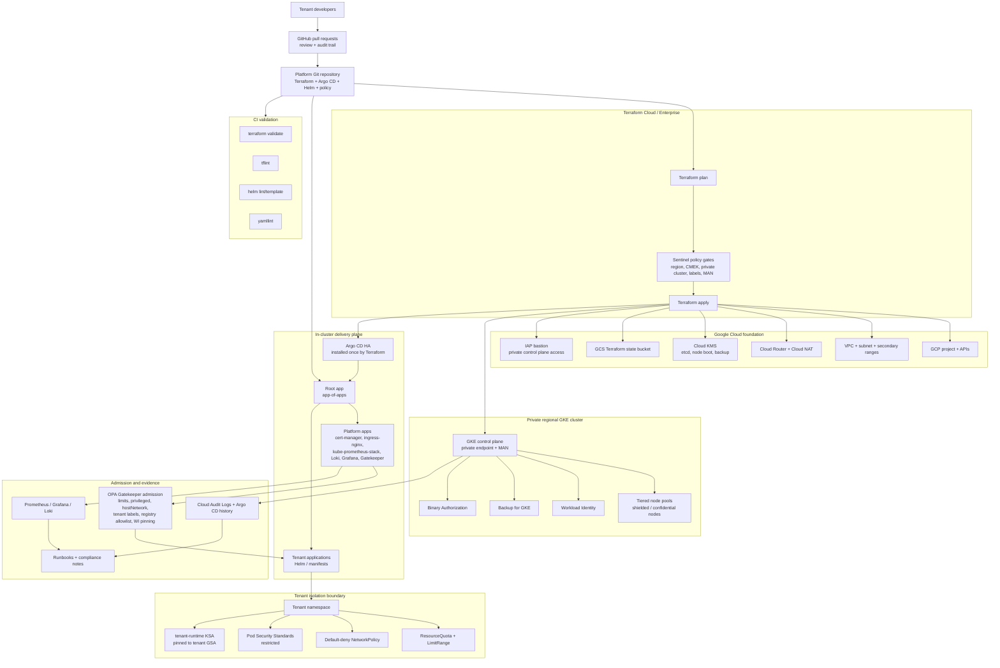

# Architecture diagram

This diagram shows the intended operating model for the platform: Terraform
owns the cloud substrate, Argo CD owns in-cluster delivery, and policy gates
run at the point where they have the right visibility.

## Trust boundaries

| Boundary | Owner | Main controls |
| --- | --- | --- |
| Git / review | Platform + security reviewers | PR review, branch protection, CODEOWNERS, CI |
| Terraform apply | Platform engineering | Terraform Cloud, Sentinel, state isolation |
| Cloud substrate | Platform engineering | private networking, KMS, IAM, audit logs |
| In-cluster delivery | Platform engineering | Argo CD AppProjects, sync windows, app-of-apps |
| Tenant namespace | Tenant team within platform guardrails | quotas, NetworkPolicy, PSS, Workload Identity |
| Admission | Platform security | Gatekeeper constraints, Binary Authorization |
| Evidence | Platform + risk/compliance | logs, Argo CD history, runbooks, compliance mapping |

## Main data/control flows

1. Developers open pull requests against the platform or tenant repositories.
2. CI validates Terraform, Helm, and YAML before merge.
3. Terraform plans are evaluated by Sentinel before infrastructure can be applied.
4. Terraform creates the cloud substrate, GKE cluster, and Argo CD control plane.
5. Argo CD pulls from Git and reconciles platform add-ons and tenant applications.
6. Gatekeeper evaluates Kubernetes API writes before workloads land in the cluster.
7. Audit logs, Argo CD history, and observability signals provide operational and compliance evidence.

