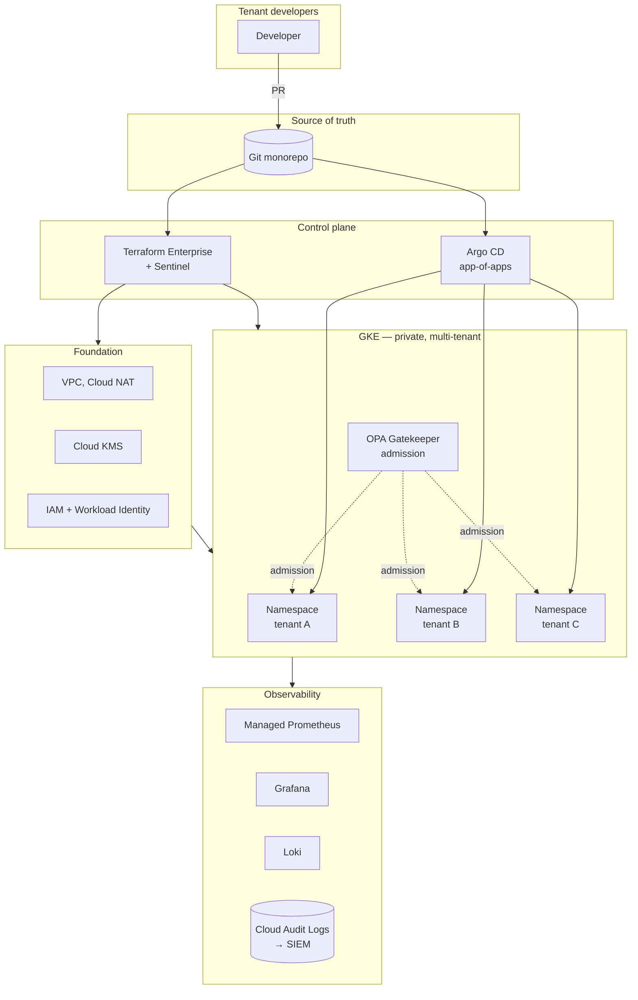

# Architecture diagram

> v0.1 ships with this Mermaid placeholder. Replace `architecture.svg`
> with an Excalidraw export before pinning the repo to LinkedIn — recruiters
> notice diagrams that don't look auto-generated.

